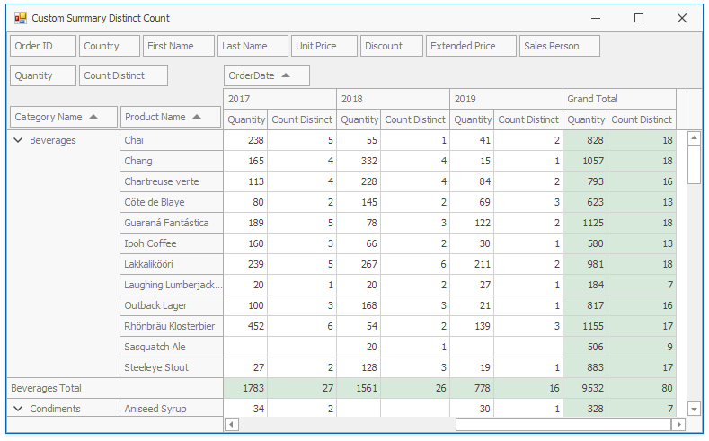

<!-- default file list -->
*Files to look at*:

* [Form1.cs](./CS/CustomSummaryDistinctCountExample/Form1.cs) (VB: [Form1.vb](./VB/CustomSummaryDistinctCountExample/Form1.vb))
<!-- default file list end -->
# How to Create a Custom Summary Type to Display the Distinct Value Count

This example handles the [PivotGridControl.CustomSummary](https://docs.devexpress.com/WindowsForms/DevExpress.XtraPivotGrid.PivotGridControl.CustomSummary) event that occurs when the control calculates a summary for a field whose [SummaryType](https://docs.devexpress.com/CoreLibraries/DevExpress.XtraPivotGrid.PivotGridFieldBase.SummaryType) is [PivotSummaryType.Custom](https://docs.devexpress.com/CoreLibraries/DevExpress.Data.PivotGrid.PivotSummaryType). The event handler calls the [e.CreateDrillDownDataSource](https://docs.devexpress.com/CoreLibraries/DevExpress.XtraPivotGrid.Data.PivotGridCustomSummaryEventArgsBase-1.CreateDrillDownDataSource) method to retrieve the underlying data rows for the current cell, counts distinct values and returns the result to the [e.CustomValue](https://docs.devexpress.com/CoreLibraries/DevExpress.XtraPivotGrid.Data.PivotGridCustomSummaryEventArgsBase-1.CustomValue) property.

API in this example:

* [PivotGridControl.CustomSummary](https://docs.devexpress.com/WindowsForms/DevExpress.XtraPivotGrid.PivotGridControl.CustomSummary) event
* [PivotGridField.SummaryType](https://docs.devexpress.com/CoreLibraries/DevExpress.XtraPivotGrid.PivotGridFieldBase.SummaryType) property
* [PivotGridCustomSummaryEventArgs.CreateDrillDownDataSource](https://docs.devexpress.com/CoreLibraries/DevExpress.XtraPivotGrid.Data.PivotGridCustomSummaryEventArgsBase-1.CreateDrillDownDataSource) method
* [PivotDrillDownDataRow](https://docs.devexpress.com/CoreLibraries/DevExpress.XtraPivotGrid.PivotDrillDownDataRow) class
* [PivotGridCustomSummaryEventArgs.CustomValue](https://docs.devexpress.com/CoreLibraries/DevExpress.XtraPivotGrid.Data.PivotGridCustomSummaryEventArgsBase-1.CustomValue) property

**See also:**

* [Summarization](https://docs.devexpress.com/WindowsForms/11728)
* [Pivot Grid Expression Syntax](https://docs.devexpress.com/CoreLibraries/120512)
* [Unbound Fields](https://docs.devexpress.com/WindowsForms/1799)
* [Binding to Excel Data Source](https://docs.devexpress.com/WindowsForms/115529)

Examples for other platforms:
* [WPF -  How to Create a Custom Summary Type to Display the Distinct Value Count](https://github.com/DevExpress-Examples/how-to-implement-custom-summary-e2136)
